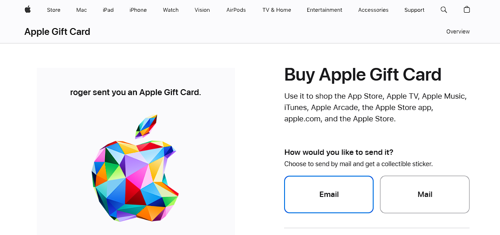
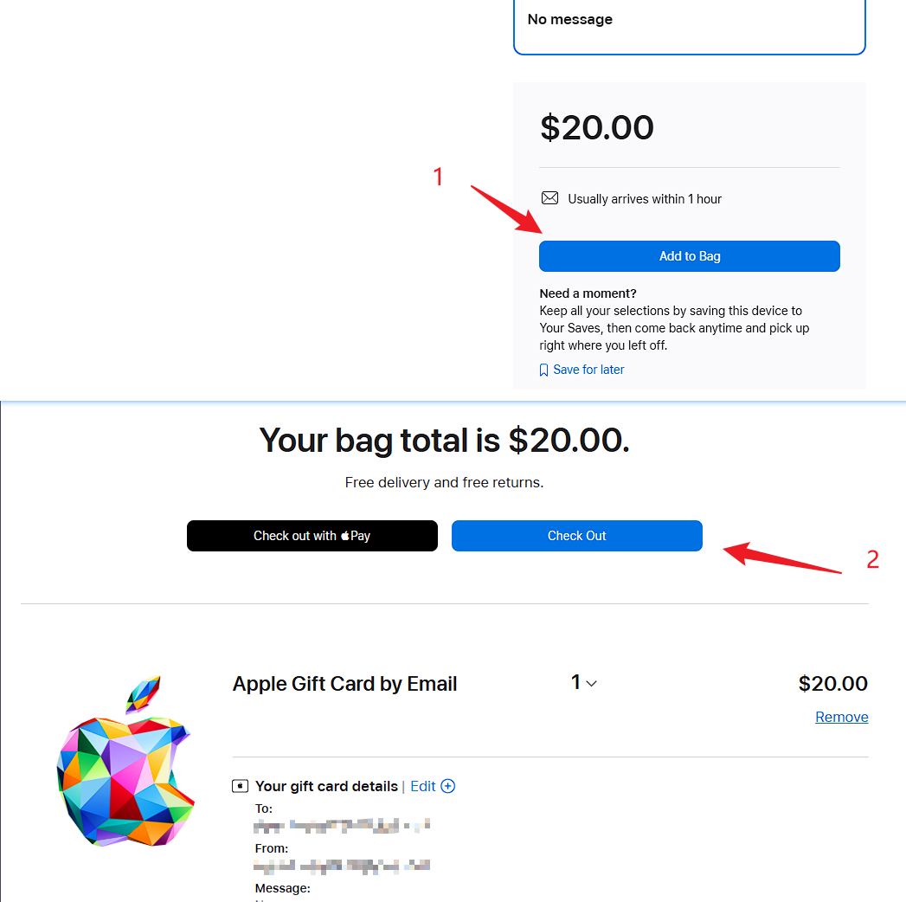
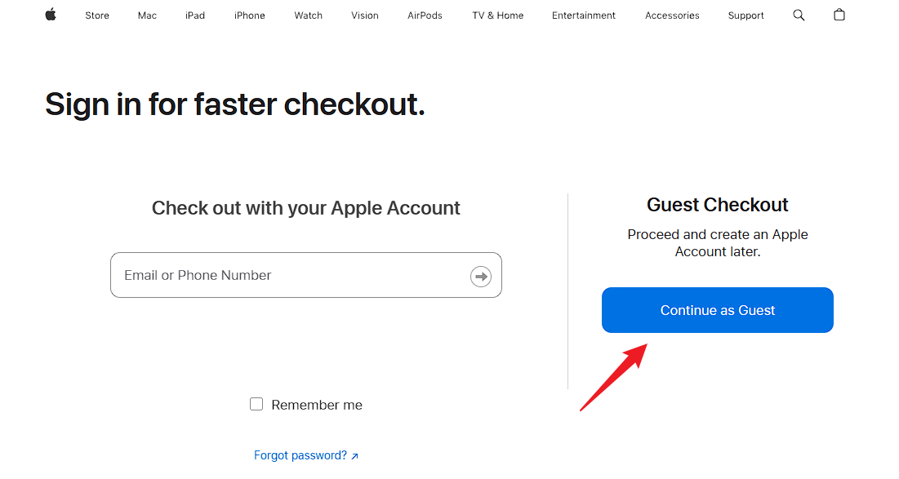
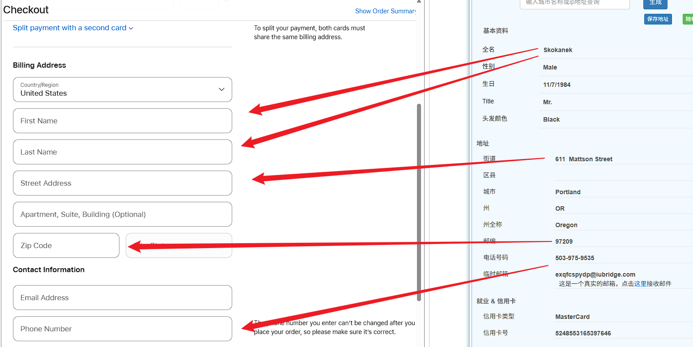
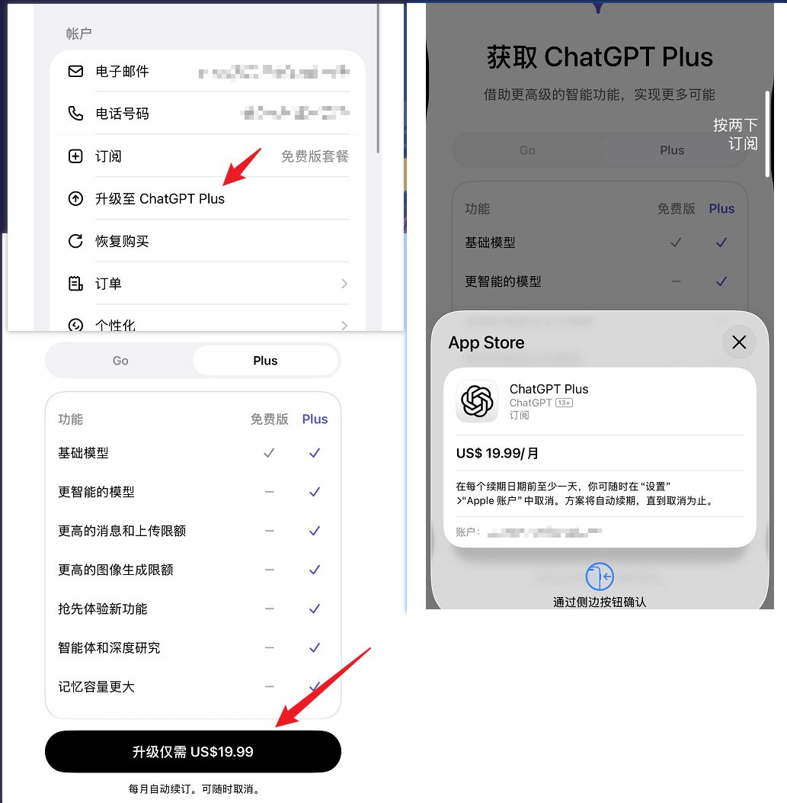

## 目的

我想写一篇关于 如何使用一套方法安全订阅国外模型的官方服务 的公众号文章

## 前提需要在开头说明

用户需要具备上网的条件，但本篇文章不涉及如何上网的部分

苹果用户需要有美区ID，但本篇文章没有怎么注册美区苹果ID的部分

而且需要提前准备VISA或Master信用卡

## 正文内容

苹果和安卓用户都可以，安卓用户相对简单，使用GooglePlay绑定GooglePay就能直接订阅

苹果用户由于美区ID的支付问题会有一些绕，但本质流程是一样的，因此以苹果用户订阅GPT为例作为教程

### 1. 在App Store中登录美区ID

首先在App Store中切换成美区ID，并全程保持美区ID登录

搜索并下载GPT，然后登录自己的GPT账号

### 2. 购买苹果礼品卡

#### 2.1 选择金额和支付方式

购买苹果礼品卡有两个渠道

第一种是直接通过支付宝等第三方渠道购买，但第三方渠道据我了解有小概率的封号风险，因此本人不做推荐

第二种是直接在苹果官网购买礼品卡，这种是属于跟官方做生意，能保证账号100%安全，因此本人推荐这种方式

https://www.apple.com/shop/buy-giftcard/giftcard

选项填写指引：

- How would you like to send it? - Email
- Choose a design. - 随便
- Choose an amount. - 这里是指充值的金额，GPT Plus一个月$20，因此这里可以选择 Other Amount 然后输入20，或者想为后续的订阅充更多钱也行
- Enter your delivery details. - **重要**：这里都填自己的名字和邮箱，礼品卡的激活码会发送到这里填入的邮箱
- Want to add a personalized message? - No message

然后点击底部的 Add to Bag，来到结算台点击 Check Out

然后点击 Continues as Guest

选择 Credit or Debit Card，这里输入 VISA/Master 卡号和 CVV

#### 2.2 填写账单地址

填写账单地址这里需要用到一些模拟信息，这里会使用一个工具

https://www.meiguodizhi.com

往下选择免税州 俄勒冈州

然后将上面的信息搬运到 Billing Address 中，邮箱可以填自己的邮箱

点击底部的 Continue to Review，移动到 Checkout 底部，勾选 Terms & Conditions 然后再点击 Place Your Order

此时，付款完成，等待发送礼品卡兑换码到邮箱，预计等待10~20分钟，查收礼品卡邮件中的礼品码

### 3. 使用礼品卡充值美区ID

在 App Store 中输入邮件中收到的礼品码进行充值

### 4. 订阅GPT Plus服务

