# 怎么用 AI 工具做出一个 WEB 版宏观经济分析报告

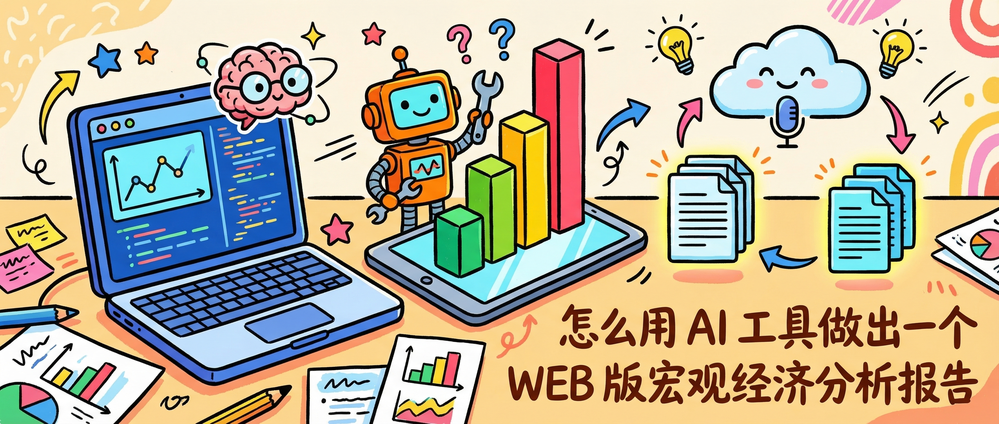

## 00 前言

上次完成了2025年第四季度的 Web 版宏观经济分析报告，从数据分析、内容收集、前端实现，都是在 AI 工具的加持下完成的，在此分享一下这次报告制作的全过程。

这篇文章会记录包括工具怎么选、**Agent Skills** 怎么用、以及我们所使用的 **AI** 工作流。

**本文内容：**
- **01 工具全景**：四类 AI 工具的定位，以及这份报告的具体选型
- **02 工作流框架**：核心逻辑、可复用性，以及使用第三方工具前必须考虑的数据安全问题
- **03 完整工作流**：六步从数据到报告上线的完整过程，含 Agent Skills 实战对比

## 01 做这份报告用到的工具

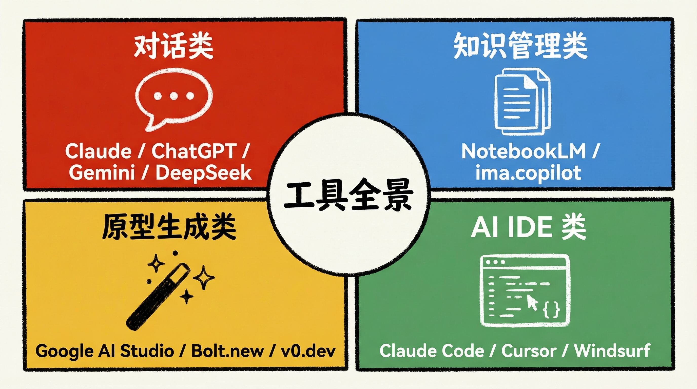

做这份报告用到了四类工具：

| 类型 | 代表工具 | 一句话定位 |
|---|---|---|
| **对话类** | Claude / ChatGPT / Gemini / DeepSeek / Kimi | 自然语言问答，查资料、聊天的高频入口 |
| **知识管理类** | NotebookLM / ima.copilot | 基于上传的文档来回答，不凭空生成，有来源 |
| **原型生成类** | Google AI Studio / Bolt.new / v0.dev / Lovable | 描述需求直接生成可运行的应用，不需要动手写代码 |
| **AI IDE 类** | Claude Code / Cursor / Windsurf / GitHub Copilot | 直接读项目文件、运行代码、改文件，AI 真正帮你写代码 |

选型逻辑是：

- 对话类工具只能聊天，没法真正执行任务，它能告诉你怎么做，但不会帮你做出来，所以整个工作流里它没有占主要位置
- 内容收集这件事交给原生支持大规模文档检索的 NotebookLM，它能完全消化大量文档并具有优秀的检索能力
- Web 原型用免费的 Google AI Studio 快速生成，省掉反复调风格时的 token 消耗
- 本地代码迭代、填充内容、处理细节使用 Claude Code 等 AI Coding 工具进行处理

其中，我们主要用到了 NotebookLM、Google AI Studio 和 Claude Code，三类工具串联，各干各最擅长的部分，完成最终的报告生成，后面会展开说。

## 02 工作流框架

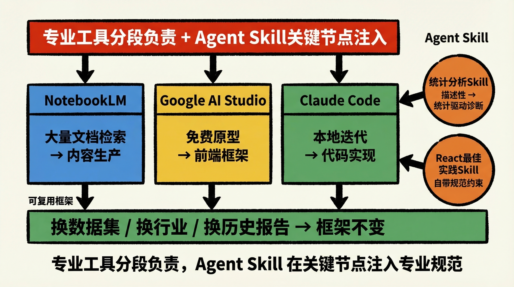

整个工作流的核心逻辑可以用一句话总结：**专业工具分段负责，Agent Skill 在关键节点注入专业规范**。

这套框架抽象为三个层次：

| 层次 | 工具 | 职责 |
|---|---|---|
| **内容层** | NotebookLM | 大规模文档检索 + 结构化内容生产 |
| **原型层** | Google AI Studio | 免费快速生成可运行的前端框架 |
| **实现层** | Claude Code | 本地精细迭代、填充内容、部署交付 |

Agent Skill 作为横切关注点，在任何需要专业规范的节点注入——内容生产阶段注入统计分析规范，代码实现阶段注入 React 最佳实践。每个 Skill 只需要安装一次，对整个项目生命周期持续生效。

### 复用性

这套流程可以直接复用：换一个数据集、换一个行业、换一套历史报告——框架不变，工具不变，Skill 不变，只有内容换掉。

具体映射：

- **Step 1**（历史报告 → 编写指南）适用于任何有历史积累的报告类型，换一批历史文件即可
- **Step 2/3**（文章 → 知识库 → 初稿）只需把参考文章替换成新领域的资料
- **Step 4**（前端框架生成）提示词稍作修改可以生成不同风格的演示系统
- **Step 5**（基础组件 + Skill）完全通用，组件和规范不变，只替换内容数据

### 数据安全

这套工作流里用到了 NotebookLM 和 Google AI Studio 等第三方在线服务，**使用前必须先判断数据的敏感程度**——上传到这些平台的内容会经过第三方服务器处理，不适合放公司内部的敏感数据。

**适合使用第三方工具的数据：**
- 政府或监管机构对外公开的统计数据（国家统计局、央行等）
- 媒体、研究机构对外发布的分析文章和报告
- 已完成脱敏处理、不含可识别信息的数据集

**不适合使用第三方工具的数据：**
- 公司内部财务数据、客户数据、经营数据
- 任何涉及个人隐私的信息
- 竞争敏感信息，如战略规划、未发布的产品或合同细节

这份宏观经济报告用到的数据全部来自公开渠道（国家统计局统计数据、公开发布的解读文章），所以可以直接上传到 NotebookLM 和 AI Studio。如果场景换成公司内部业务分析，需要把在线工具替换为本地部署的方案，或使用与服务商签订了数据安全协议的企业版服务。

## 03 完整工作流：六步从数据到报告上线

这份报告主要使用 NotebookLM、Google AI Studio、Claude Code 等 AI 工具在整个过程里是串联关系，每一步各有分工。

### 工作流全景

在展开每一步之前，先给整个流程一张全景图：

| 步骤 | 工具 | 做什么 | 输出 |
|---|---|---|---|
| Step 1 | Claude Code | 读取 7 篇历史报告，提炼编写指南 | 报告框架 + 写作规范文档 |
| Step 2 | NotebookLM | 上传 105 篇参考文章，注入编写指南 | 可跨文档检索的知识库 |
| Step 3 | NotebookLM + Agent Skill | 按章节逐一提问，生产内容初稿 | 各章节结构化初稿 |
| Step 4 | Google AI Studio | 用提示词生成前端框架 | 可运行的 React 项目模板 |
| Step 5 | Claude Code + Agent Skill | 填充内容、迭代样式、拆分组件 | 完整代码库（33 组件 + 27 数据文件）|
| Step 6 | 腾讯云 | 部署上线 | 40 张幻灯片的在线演示系统 |

三类工具各管一段：NotebookLM 负责内容生产，Google AI Studio 负责原型生成，Claude Code 负责代码实现。Agent Skill 在 Step 3 和 Step 5 分别注入统计分析规范和 React 最佳实践，让 AI 在专业场景下自动变专业。

### Step 1：Claude Code 提炼报告编写指南

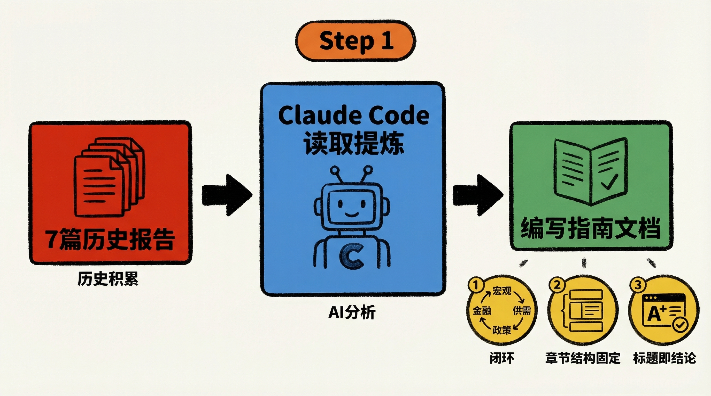

首先，先用 Claude Code 读取团队历史上已有的 7 篇历史报告，让它从中提炼出一份指南文档，包括宏观经济分析报告应该包含哪些模块、每个模块的写作逻辑是什么、有哪些关键指标必须覆盖。之所以用历史报告而非直接让 AI 写一份通用指南，是为了让指南延续团队自身的分析框架和行文风格，而不是套用 AI 的默认模板。

提炼出来的指南确立了两个核心结构：

**写作逻辑**：遵循"宏观总览 → 供需拆解 → 政策与效应 → 金融印证"的闭环——先看 GDP 总量定调经济周期，再拆解到产业和三驾马车，同时量价结合（实际增速 + 平减指数），最后用社融、信贷等金融数据交叉印证。

**章节结构**：分两大板块，宏观层（GDP、生产、消费、投资、进出口、财政）和金融层（M1/M2、社融信贷）；每个章节都有固定的核心图表和写作重点，比如 GDP 章节必须做名义 vs 实际的"温差"对比，消费章节重点看品类分化和城市分化。

**写作规范**：指南里有一条对最终报告影响最大的规则——「标题即结论」，每一页 PPT 的标题不写描述（「GDP数据」），而是直接写出核心判断（「三季度 GDP 增速延续回落至 4.8%，名义 GDP 增速降幅收窄」）。这条规则在 Step 2 里被 NotebookLM 完整执行，所有章节初稿的页面标题都自然带着结论，而不是章节名称。

这份指南后续会作为整份报告的内容基准，带入 Step 2，确保 AI 产出的内容符合专业报告的分析逻辑。

### Step 2：NotebookLM 收集内容

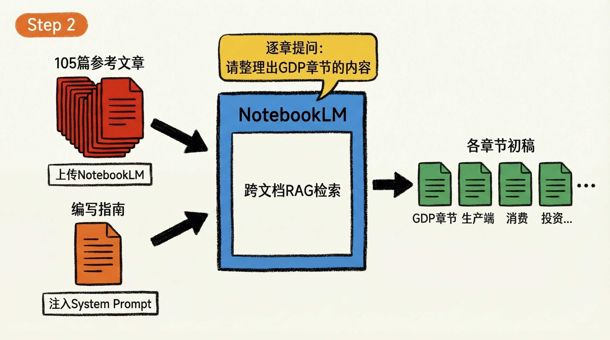

这里选 NotebookLM 是因为 NotebookLM 天生就是为了大量文档的联合检索而设计的，我们的参考文章数量非常多，一共参考了 105 篇，来自国家统计局、微信公众号等渠道的当季解读文章，上传到 NotebookLM 后即可以完成跨文档问答，而且它底层使用的是 Gemini 3 系列的模型，在模型的基础能力上非常强力，十分契合它的专业能力。

在 NotebookLM 里上传这 105 篇宏观经济解读文章，同时把 Step 1 生成的编写指南放进 NotebookLM 的系统提示词（Instructions）里，这样每次提问时 AI 都会自动按照指南的框架和写作逻辑来产出内容，不需要每次重复粘贴。

### Step 3：NotebookLM 生产初稿

这一步的主角是 NotebookLM——内容从哪里来、怎么检索、按什么结构输出，全部由它负责。Agent Skills 在此基础上作为辅助手段注入，补足专业分析方法上的缺口。

按章节逐一提问：

> "请整理出 GDP 章节的内容"

这样逐章产出，每个章节都是独立完整的一份。以 GDP 章节为例，NotebookLM 产出的是结构化的 PPT 页面内容，共 5 页，每页都有标题即结论、关键数据要点，以及图表建议。第 1 页实际输出如下：

> 页面 1：宏观总览——全年5%目标达成，Q4增速受基数影响回落
> 
> 标题：2025年GDP突破140万亿增长5.0%，四季度增速回落至4.5%但环比韧性仍存
> 
> - 总量定调：2025年全年国内生产总值（GDP）达 140.2万亿元，按不变价格计算同比增长 5.0%，圆> 满实现全年预期目标，“十四五”胜利收官。
> - 季度走势“前高后低”： 
>   - 受基数效应（去年同期政策显效抬高基数）及内需波动影响，GDP增速呈逐季回落态势：Q1 5.> 4% -> Q2 5.2% -> Q3 4.8% -> Q4 4.5%。
>   - 环比动能：四季度GDP季调环比增长 1.2%（三季度为1.1%），显示在增量政策托底下，经济边际> 动能并未失速，仍保持平稳。
> - 人均水平：人均GDP接近10万元人民币（约1.4万美元），稳居中等偏上收入国家行列。
> 【图表建议】
> - 建议左图：2024Q1-2025Q4 季度GDP当季同比增速走势图（展示5.4%至4.5%的下行曲线）。
> - 建议右图：2025年分季度GDP环比增速变化图（突出Q4的1.2%增幅，验证韧性）。

分析也是成体系的——从宏观总览（全年目标达成情况）、生产端拆解（三产分化）、需求与贡献（三驾马车），到价格温差（名义 vs 实际 GDP 的"负向剪刀差"），最后是 2026 年展望。

这一步做的不只是信息收集，而是同时完成内容生产——产出的已经是按专业报告格式和分析逻辑组织好的各章节初稿，可以直接进入后续流程。

#### Agent Skills：让 AI 在专业场景下变专业

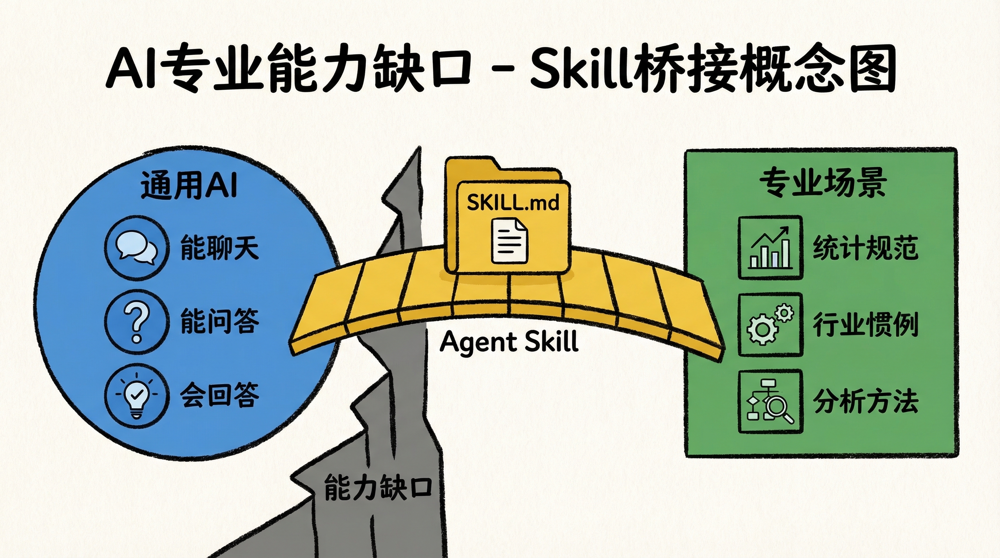

NotebookLM 解决的是"从哪里找内容"的问题，**Agent Skills** 在此基础上解决"用什么专业方法分析和输出"的问题——AI 通用能力很强，但它不了解你的行业惯例、数据规范、或某个领域的标准分析方法，Agent Skills 就是针对这种缺口的解法，让 NotebookLM 产出的内容在专业性上再上一个台阶。

Agent Skills 是一套开放标准，本质是给 AI 安装"专业技能包"。每个 skill 是一个文件夹，里面最少会有一个 `SKILL.md` 文件，写清楚 AI 在这个场景下该怎么思考、用什么方法、输出什么格式。一个示例 skill 为例：

```
statistical-analysis/
├── SKILL.md (main instructions)
├── FORMS.md (form-filling guide)
├── REFERENCE.md (detailed API reference)
└── scripts/
    └── fill_form.py (utility script)
```

调用方式：

- `SKILL.md` 的元数据在 AI 启动时自动注入系统上下文，当任务内容与 skill 的适用场景匹配时触发生效
  ```yaml
  ---
  name: pdf-processing
  description: Extract text and tables from PDF files, fill forms, merge documents. Use when working with PDF files or when the user mentions PDFs, forms, or document extraction.
  ---
  ```
- 也可以通过指定 `技能名` 的方式手动调用

比如说，装了统计分析 skill，AI 就会用 IQR 等标准统计方法识别异常值；装了 SQL 规范 skill，它就会按你们团队的命名规范写查询。

##### 生态现状

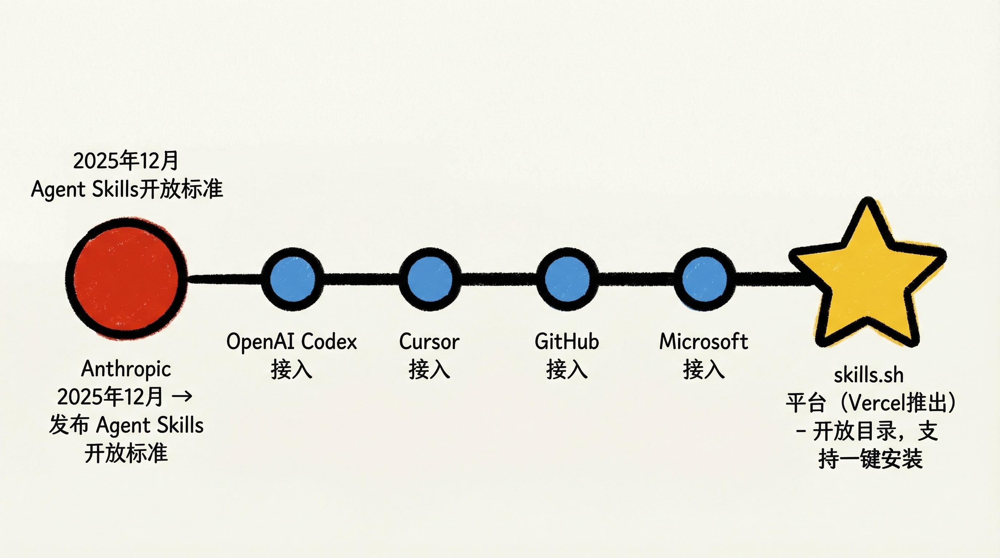

Anthropic 在 2025 年 12 月把它作为开放标准发布，现在 OpenAI Codex、Cursor、GitHub、Microsoft 已将其集成进各自产品。

我最常用的一个 Agent Skills 平台是 Vercel 推出的 [skills.sh](https://skills.sh)，它是一个开放的 skill 目录，可以搜索和安装各类 skill，支持 Claude Code、Cursor、GitHub Copilot 等主流 AI IDE 一键配置。

##### 使用前后对比

###### 测试数据集

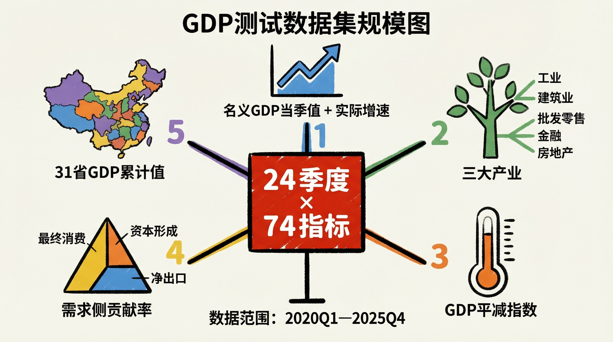

国家统计局 GDP 季度数据，时间范围 2020Q1—2025Q4，共 24 个季度、74 个指标，覆盖：
- 名义 GDP 当季值 + 实际增速（不变价当季同比）
- 三大产业及细分行业拆分（工业、建筑业、批发零售、金融、房地产等）
- GDP 平减指数（衡量价格水平变化）
- 需求侧贡献率（最终消费 / 资本形成 / 货物和服务净出口）
- 31 个省级行政区的 GDP 累计值

**场景**：用同一个提示词让 Claude Code 读取这份数据，分别在安装 skill 前后各生成一份报告，直接对比差距。

###### 安装 Skill 之前

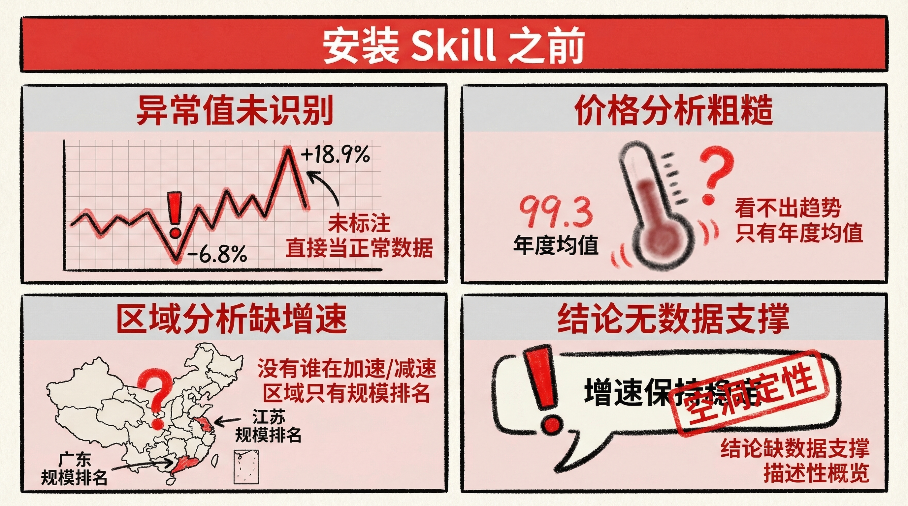

提示词：

```
分析 GDP现价当季值等_20260228_103456.xlsx 这些数据，然后在同级目录下生成报告 分析报告.md 文件
```

生成的报告结构不错——覆盖总量、产业结构、需求侧、价格水平、区域格局，逻辑清晰，关键事件（2020Q1 疫情冲击、2021Q1 低基数效应）也标注到位。

**但专业性有明显短板**：

- 2020Q1 的 **-6.8%** 和 2021Q1 的 **+18.9%** 被直接放进走势图，没有识别为统计异常值，容易误导判断
- 价格分析只给出年度均值（如"2024 年平减指数约 99.3"），看不出通缩是在加深还是在收窄
- 区域分析只有规模排名，广东第一、江苏第二，但没有增速分化，不知道谁在加速、谁在减速
- 结论全是定性判断，"增速保持稳定"——稳定到什么程度？没有数据支撑

###### 安装之后

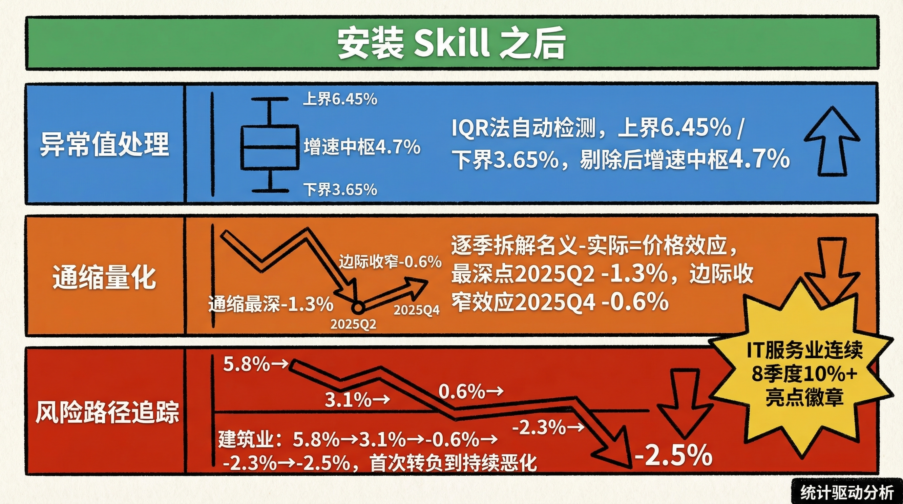

Skill 可以在 [skills.sh](https://skills.sh) 搜索和安装一个 Anthropic 推出的统计分析 skill ，用 `npx skills add` 命令一行搞定：

```bash
npx skills add anthropics/knowledge-work-plugins --skill statistical-analysis
```

同样的提示词，同样的数据，生成的报告：

**异常值处理**：
- 用 IQR 法自动识别统计极值：上界 6.45%、下界 3.65%
- **2021Q1（+18.9%）** 被标注为低基数效应造成的统计异常，**2020Q1（-6.8%）** 标注为疫情冲击极值
- 剔除两端异常值后，真实增速中枢约 **4.7%**，标准差收窄至 1.1 个百分点

**通缩量化**：
- 逐季拆解"名义增速 − 实际增速 = 价格效应"
- 明确标注通缩启动（2023Q2，价格拖累 -0.8%）、最深点（2025Q2，-1.3%）、边际收窄（2025Q4，-0.6%）
- 进一步细拆至三个产业：**第二产业是通缩重灾区**（2025 年均值 97.5），第三产业是缓冲垫

**风险信号追踪**：
- 建筑业增速时序：5.8%（2024Q1）→ 3.1%（2025Q1）→ **-0.6%（2025Q2）→ -2.3%（Q3）→ -2.5%（Q4）**，首次转负到持续恶化的完整路径一目了然
- 结论附带信心程度标注（高 / 中），坦诚区分确定性判断和不确定性判断

**亮点佐证**：
- IT 服务业（信息传输、软件和信息技术服务业）连续 8 个季度保持 10%+ 增速——从 2024Q1 的 13.7% 到 2025Q4 的 10.7%，是全文唯一的强正向信号，被单独标注为「数字经济驱动的结构性亮点」
- 区域格局出现逆转：西部省份省均增速（4.4%）高于东部（3.9%），属近年罕见格局，报告将其标注为值得追踪的趋势性变化，而不只是规模排名

###### 效果对比

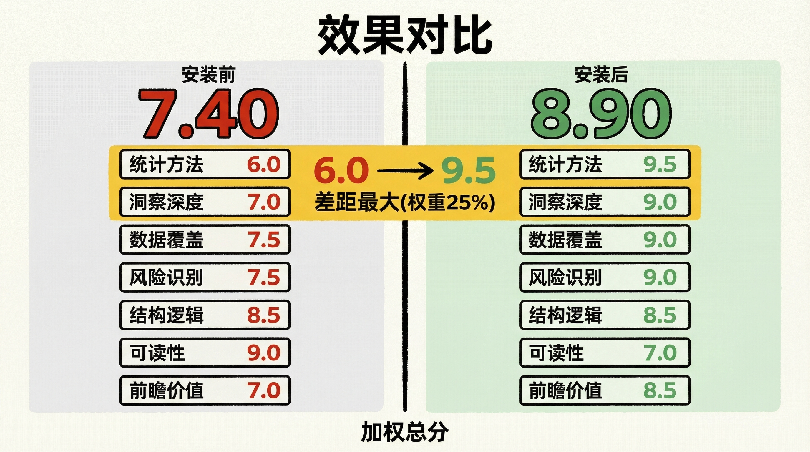

为了让对比更客观中立，把两份报告交给 Codex，以「以资深宏观分析师视角，对这两份报告以相同标准的多个维度分别打分（满分 10 分），结合权重算出加权总分，每项附简短评语」为提示词，让竞品 AI 来裁判。得分如下：

| 评价维度 | 权重 | 安装前 | 安装后 |
|---|---|---|---|
| 统计分析方法 | 25% | 6.0 | 9.5 |
| 洞察深度 | 20% | 7.0 | 9.0 |
| 数据覆盖完整性 | 15% | 7.5 | 9.0 |
| 风险识别质量 | 10% | 7.5 | 9.0 |
| 结构逻辑 | 10% | 8.5 | 8.5 |
| 可读性与传播性 | 10% | 9.0 | 7.0 |
| 前瞻性与实用价值 | 10% | 7.0 | 8.5 |
| **加权总分** | **100%** | **7.40** | **8.90** |

差距最大的是"统计分析方法"（权重最高的一项，6.0 vs 9.5）

- 安装前的报告停留在描述层面，只是把数据读出来
- 安装后的报告有了更专业分析——识别异常值、量化价格效应、追踪风险路径，每个结论都有数据支撑。

同样的 AI，同样的数据，同样的提示词——装了统计分析 skill，分析质量从"描述性概览"变成了"统计驱动的经济诊断"。

我觉得这个类比很贴切：Agent Skills 就是新时代的 App——Agent 是新 OS，Skill 是装在上面的专业能力包，写一次、到处用、社区共享，和当年 App Store 的逻辑如出一辙。不需要懂 Prompt 工程，装个 Skill 就能让 AI 在特定领域直接变专业。

### Step 4：Google AI Studio 生成前端框架

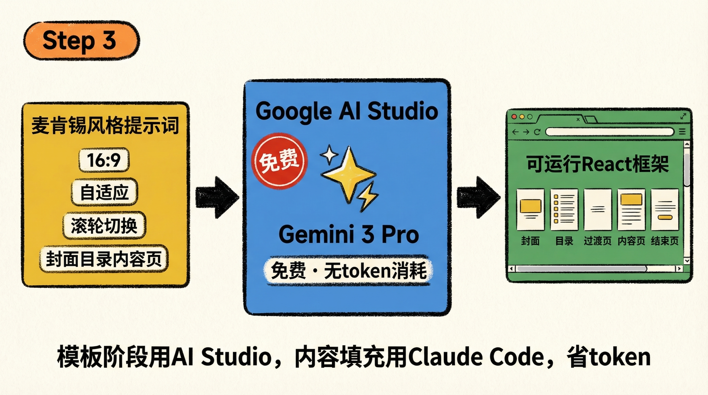

这一步的目标不是生成完整内容，只是拿到一个可以跑起来的基础项目模板——页面结构、视觉风格、交互逻辑定好，内容全部留空，后续交给 Claude Code 在本地迭代填充。

选 Google AI Studio 有个很实际的原因：**它免费，而且可以使用 Gemini 3 Pro，做前端效果很不错。** 模板阶段往往要反复调风格——换布局、换配色、换交互方式，这个阶段如果用 Claude Code 来回生成，token 额度消耗会很快。用 AI Studio 把框架定好，再交给 Claude Code 做内容填充，是更省成本的做法。

提示词如下：

> 构建一个麦肯锡公司设计风格的包含封面、目录、章节过渡页、内容页（采用网格布局，包含标题、若干论点内容卡片、1个折线图、1个表格，折线图和表格各占50%的宽度，图表自适应宽高不出现滚动条）和结束页的幻灯片演示系统。整体视觉效果丰富、明亮、现代、高级、动效。幻灯片宽高比为16:9，自适应占满屏幕。支持鼠标滚轮和键盘上下键切换幻灯片。

拆解一下这段提示词的写法：

- **"麦肯锡风格"**：用一个大家熟知的品牌作为视觉锚点，AI 能立刻理解配色、排版、专业感的方向，比说"商务风"或"高端风"更精准，不需要再描述具体颜色
- **页面类型清单**：把需要哪几种页面（封面、目录、过渡页、内容页、结束页）逐一列出，AI 不用猜，直接生成完整结构
- **内容页的具体布局**：内容页是最核心的页面，所以要指定得最细——网格布局、论点卡片、折线图+表格各占 50%，用具体比例约定好，避免 AI 自由发挥后再反复调整
- **"图表自适应宽高不出现滚动条"**：这是一个提前排坑的约束——AI 生成的图表组件很容易出现内容溢出或滚动条，提前说清楚
- **"16:9，自适应占满屏幕"和交互方式**：确保输出是一个真正可以演示的系统，而不是静态页面

AI Studio 直接输出一套可以运行的 React 项目框架，下载到本地，作为后续迭代的起点。

### Step 5：AI Coding 工具 + Agent Skill 迭代

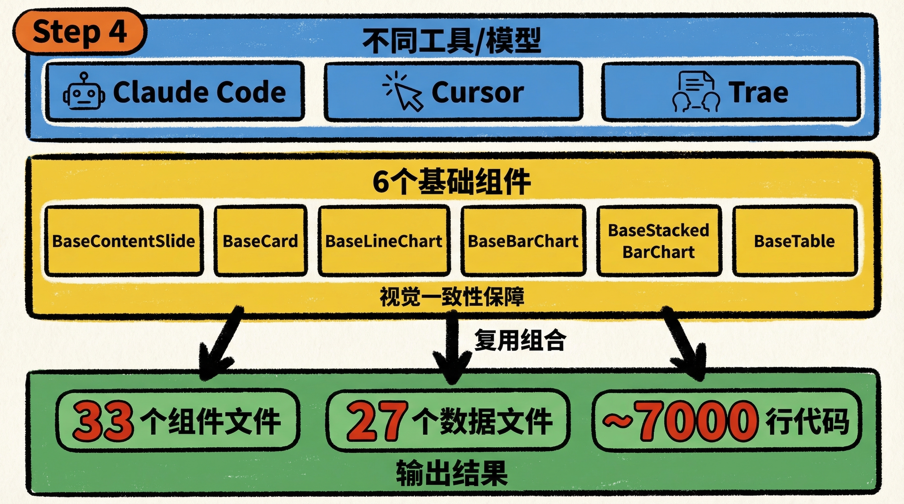

和 Step 3 展示的统计分析 skill 同样的机制，这里为 React 开发装上专业规范——AI Studio 下载下来的项目是 React 框架，在 AI Coding 工具里先装上 Vercel Labs 维护的 `vercel-react-best-practices` skill（同样从 [skills.sh](https://skills.sh) 安装）。这个 skill 按影响程度分级，涵盖消除数据瀑布、包大小优化、服务端性能、重新渲染优化等方向——装上之后，AI Coding 工具在迭代修改时会自动按照这套规范来生成代码，避免写出性能问题或结构混乱。

```bash
npx skills add vercel-labs/agent-skills --skill vercel-react-best-practices
```

然后用自然语言驱动迭代：

> "把 Step 3 整理的报告内容填入对应幻灯片"

AI Coding 工具读取项目文件，结合 skill 里的规范，自动改代码、填内容、调样式。

**一个让多人协作顺畅的关键做法**：在开始填内容之前，先把可复用的元素抽出来做成基础组件——`BaseContentSlide`（幻灯片容器）、`BaseCard`（论点卡片）、`BaseLineChart`（折线图）、`BaseBarChart` / `BaseStackedBarChart`（柱状图）、`BaseTable`（表格）。

这样做的原因在多人协作场景下尤其直接：这份报告里，三个人用了不同的工具和模型——有人用 Claude Code，有人用 Cursor，有人用 Trae，还有部分内容借助了 OpenAI Codex。风格漂移来自两个层面：工具层面，不同 IDE 的代码生成习惯不同；模型层面，Claude 和 GPT 对同一个组件的默认实现方式就不一样，圆角、间距、配色倾向各有各的偏好。两个变量叠在一起，如果每一页幻灯片都由各人用自己的工具和模型独立生成，等到合并时整体风格几乎必然散掉，逐页对齐的代价极高。

基础组件做好之后，不管谁用什么工具生成新的幻灯片页，都是在组合复用同一套组件。视觉一致性由组件自身保证，不依赖某个 AI 的\"记忆\"，也不依赖团队成员之间的口头约定——这才是可以多人持续迭代的结构。

**另一个配套做法**：每一页幻灯片对应一个独立的 `.tsx` 文件，比如 `CoverSlide.tsx`、`TableOfContentsSlide.tsx`、`ContentSlide05.tsx`。好处有两层：

- **对人**：根据网页上显示的页码，能立刻知道要改哪个文件，不用在代码里翻找
- **对 AI**：修改某一页时直接 `@ContentSlide05.tsx` 定位，AI 不需要扫描整个项目才能确定要改哪里。全局查询会消耗大量 token，也会占用当次 session 的 context window——文件拆得细，每次对话的上下文就能留给真正有用的信息

按这套做法完成全部迭代后，整个项目共有 33 个组件文件（6 个基础组件 + 过渡页 + 各章节内容页）、27 个独立的数据文件（原始 xlsx 转换而来的 TypeScript 格式），总代码量约 7000 行。

### Step 6：部署上线

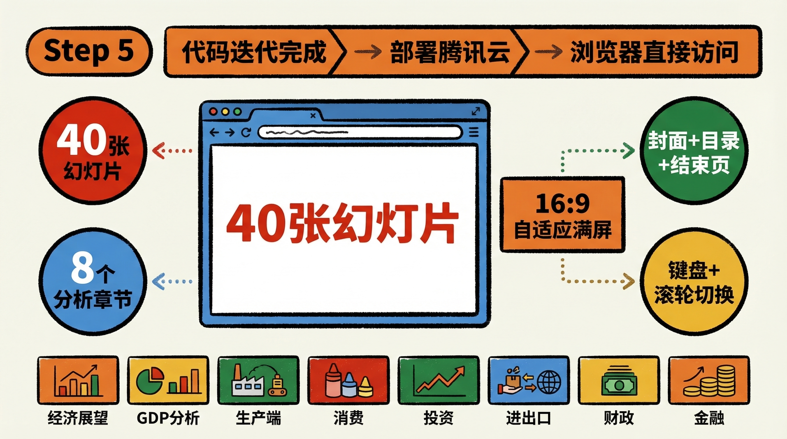

完成全部代码迭代后，部署到腾讯云，浏览器直接访问：**[https://hongguanppt.top](https://hongguanppt.top)**

**最终交付：40 张幻灯片的交互式演示系统**

一套可在浏览器直接运行的交互式演示系统，共 **40 张幻灯片**，16:9 自适应铺满屏幕，支持鼠标滚轮和键盘上下键切换。

整体结构：**封面 + 目录 + 8 个分析章节 + 结束页**，章节之间各有一张过渡页衔接：

| 章节 | 主题 | 分析角度 | 内容页数 |
|---|---|---|---|
| 01 | 2026 年经济展望 | 温差收敛，体感改善 | 1 |
| 02 | GDP 分析 | 定基调，找温差 | 5 |
| 03 | 生产端分析 | 看景气，看利润 | 6 |
| 04 | 消费分析 | 看意愿，看结构 | 5 |
| 05 | 投资分析 | 看地产拖累，看设备更新 | 4 |
| 06 | 进出口分析 | 看韧性，看抢跑 | 4 |
| 07 | 财政分析 | 看钱袋子 | 1 |
| 08 | 金融数据分析 | 看资金活性 | 4 |

每张内容页由**论点卡片 + 折线图/堆叠柱状图 + 数据表格**组成，复用 `BaseContentSlide`、`BaseCard`、`BaseLineChart`、`BaseStackedBarChart`、`BaseTable` 等基础组件，视觉一致性由组件自身保证。图表数据来自各章节对应的数据文件。

整体视觉延续 Step 3 的深蓝主色（`#051c2c`）、极简网格布局、入场动效——无需设计工具，浏览器打开即可用于演示或分发。

*（成品截图见下）*

## 03 总结

整个工作流的核心逻辑：**专业工具分段负责，Agent Skill 在关键节点注入专业规范**。每个工具干自己最擅长的事，串联起来才是高效率的工作流——统计分析 Skill 让报告从描述性概览变成统计驱动的经济诊断，React 最佳实践 Skill 让代码迭代自带规范约束。

这套流程可以直接复用：换一个数据集、换一个行业、换一套历史报告——框架不变，工具不变，只有内容不同。使用第三方工具时，确保数据来自公开渠道，公司内部敏感数据需替换为本地部署方案。
