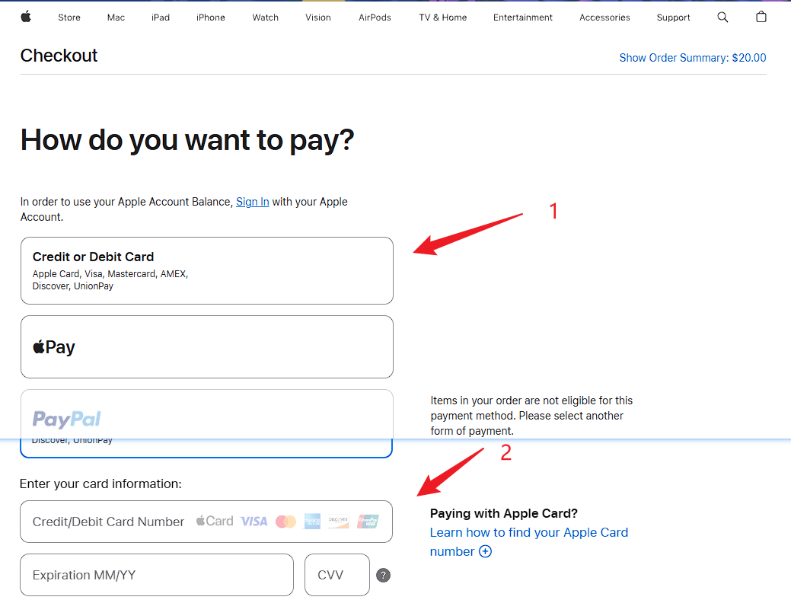
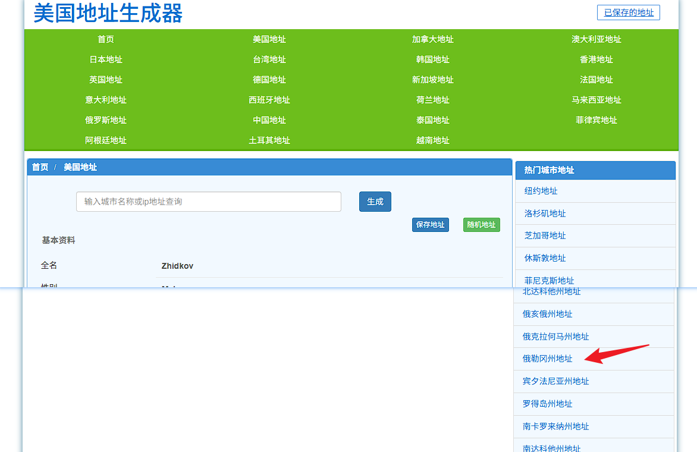

# 一套方法，安全订阅所有国外AI模型官方服务

ChatGPT、Claude、Gemini……你是不是也想用，却卡在"怎么订阅"这一步？

网上教程五花八门，有的要你找代充，有的让你用各种第三方平台。结果呢？轻则多花冤枉钱，重则账号被封。

今天分享一套我自己在用的方法，**直接跟苹果官方做生意**，安全、稳定、可复用。学会这一套，ChatGPT、Claude、Gemini、Grok——所有国外AI模型的官方订阅，全部搞定。

---

## 开始之前，你需要准备三样东西

在正式开始之前，请确认以下条件已经具备：

**1. 能够访问国际网络**

本文不涉及如何上网的部分，请自行解决。

**2. 一张VISA或MasterCard信用卡**

国内各大银行均可申请，用于在苹果官网购买礼品卡。

**3. 苹果用户需要美区Apple ID**

本文不涉及注册美区Apple ID的教程，请提前准备好。

> 安卓用户相对简单，在Google Play绑定Google Pay后可直接订阅。但由于苹果用户的支付流程稍微绕一些，本文以**苹果用户订阅ChatGPT Plus**为例，完整演示全流程。

---

## 第一步：在App Store登录美区ID

打开App Store，切换为你的美区Apple ID并保持登录状态。

然后搜索"ChatGPT"，下载安装，并登录你的ChatGPT账号。

---

## 第二步：购买苹果礼品卡

这是整个流程中最关键的一步。

### 为什么推荐官网购买？

购买苹果礼品卡有两种渠道：

- **第三方渠道**（如支付宝等）：价格可能略便宜，但据了解有小概率的封号风险，**不推荐**。
- **苹果官网直购**：直接跟官方做生意，账号100%安全，**强烈推荐**。

打开苹果礼品卡购买页面：

https://www.apple.com/shop/buy-giftcard/giftcard

### 填写选项指引

按照以下内容逐项填写：

- **How would you like to send it?** → 选择 Email
- **Choose a design.** → 随便选一个喜欢的样式
- **Choose an amount.** → ChatGPT Plus月费$20，这里选 Other Amount 输入 20（也可以多充一些备用）
- **Enter your delivery details.** → **重要：收件人姓名和邮箱都填自己的**，礼品卡激活码会发到这个邮箱
- **Want to add a personalized message?** → 选择 No message

填写完毕，点击底部的 **Add to Bag**。

### 结算付款

来到购物袋页面，点击 **Check Out**。

选择 **Continue as Guest**，无需登录Apple ID。

支付方式选择 **Credit or Debit Card**，输入你的VISA/MasterCard卡号和CVV。

### 填写账单地址

账单地址需要填写一个美国地址。这里推荐一个工具：

https://www.meiguodizhi.com

打开后往下滑，选择免税州——**俄勒冈州（Oregon）**。

将生成的地址信息对应填入 Billing Address 中，邮箱可以填自己的真实邮箱。

填写完毕后，点击 **Continue to Review**，拉到页面底部，勾选 **Terms & Conditions**，然后点击 **Place Your Order**。

付款成功！接下来等待10~20分钟，苹果会将礼品卡兑换码发送到你填写的邮箱。

---

## 第三步：充值到美区Apple ID

收到邮件后，复制礼品卡兑换码。

打开App Store，进入账户页面，点击"兑换礼品卡或代码"，输入兑换码完成充值。

---

## 第四步：订阅ChatGPT Plus

打开ChatGPT App，进入订阅页面，选择升级到Plus。

系统会自动使用你的Apple账户余额完成支付。

搞定！

---

## 写在最后

整套流程总结下来就四步：

1. 登录美区Apple ID
2. 在苹果官网购买礼品卡
3. 用礼品卡充值Apple账户
4. 在App内完成订阅

**这套方法不仅适用于ChatGPT，Claude、Gemini、Grok等所有国外AI模型的官方服务，都可以用同样的方式完成订阅。**

用官方服务，告别各类不稳定的中转站。一次学会，终身受用。

如果这篇文章对你有帮助，欢迎**点赞、在看、转发**给同样需要的朋友。有任何问题，评论区见！
